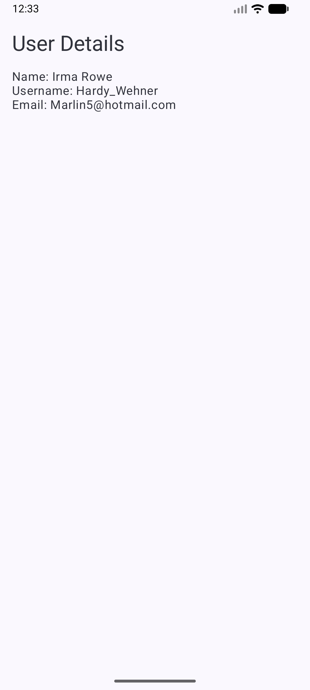
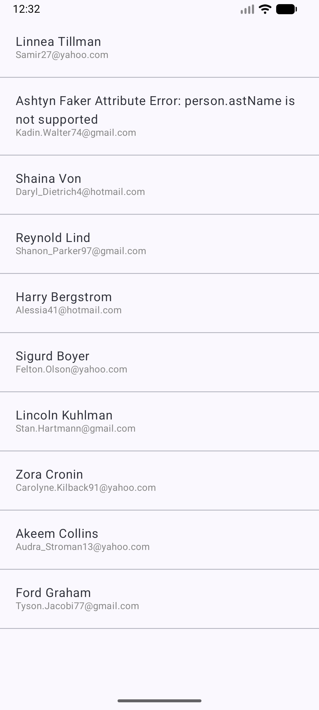

# ANZAssessment - Android Multi-Module MVI Clean Architecture

ANZAssessment is a modern Android project demonstrating **Clean Architecture**, **Multi-Module** structure, and **MVI (Model-View-Intent)** presentation pattern. It uses the latest Android technologies like Jetpack Compose, Hilt, and Kotlin Coroutines/Flow.

## 🚀 Architecture Overview

The project is divided into several modules to ensure separation of concerns, scalability, and better build times:

### 1. Layers
- **Domain Module (`:domain`)**: Contains the core business logic. Includes `UseCases`, `Repository Interfaces`, and `Domain Models`. This layer is independent of any other layer.
- **Data Module (`:data`)**: Implementation of the repository interfaces defined in the domain layer. Handles data sourcing (Network).
- **Core Modules**:
    - `:core:network`: Configures Retrofit, OkHttp, and provides network-related Hilt dependencies.
    - `:core:common`: Shared utilities, reusable UI components (`LoadingComponent`, `ErrorComponent`), and the `Resource` wrapper.

### 2. Features
- **User List (`:feature:userlist`)**: Displays a list of users fetched from a remote API using MVI.
- **User Detail (`:feature:userdetails`)**: Displays detailed information for a specific user.

### 3. App Module
- **`:app`**: The main entry point. Orchestrates the navigation between features and initializes Hilt (`@HiltAndroidApp`).

## 🛠 Tech Stack

- **Kotlin**: Language of choice for modern Android development.
- **Jetpack Compose**: Declarative UI toolkit.
- **Hilt**: Dependency injection for Android.
- **Retrofit & Gson**: For network API calls and JSON parsing.
- **Kotlin Coroutines & Flow**: For asynchronous programming and reactive data streams.
- **Navigation Compose**: For managing navigation between screens.
- **MVI (Model-View-Intent)**: Predictable state management pattern.
- **JUnit, Mockito & Turbine**: For unit testing ViewModels, Repositories, and Flows.

## 🚀 Future Improvements

While the current project demonstrates a solid foundation, several improvements could be added for production-readiness:

- **Offline Support (Room)**: Implement a local caching layer using Room database to allow users to view data without an internet connection.
- **Advanced UI/UX**:
  - Add **Dark Mode** support and better theme customization.
  - Implement **Shimmer effects** for better loading experiences.
  - Add **Pull-to-Refresh** functionality.
  - Use **AnimatedContent** for smoother transitions between states.

## 🚀 Attachments

**Screenshot** 

**Video**
[users_app.mp4](screenshots/users_app.mp4)